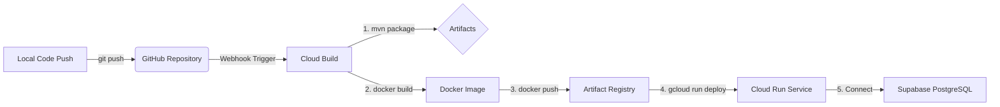

# CBP 7.0 Backend Deployment Guide

This guide explains how to configure Google Cloud Platform (GCP) resources and set up the automated CI/CD pipeline to deploy the CBP 7.0 backend onto **Google Cloud Run** connected to **Supabase PostgreSQL**.

## Deployment Pipeline Architecture



The flow is fully automated via Cloud Build configurations:
1. **Developer pushes code** to the linked GitHub repository branch (e.g. `main`).
2. **Cloud Build webhook triggers** execution of the build script `/cloudbuild.yaml`.
3. **Step 1 (Maven Build)**: Compiles the Java 25 source code and generates a Spring Boot runnable jar.
4. **Step 2 (Docker Build)**: Packages the generated jar into an image based on `eclipse-temurin:25-jre`.
5. **Step 3 (Push to Registry)**: Uploads the tagged container image to **GCP Artifact Registry**.
6. **Step 4 (Deploy to Cloud Run)**: Updates the Cloud Run service `cbp-7-backend` to run the new container revision in the `asia-south1` region.

---

## 1. GCP APIs Required

Enable the following APIs in your Google Cloud Project:
- **Cloud Run Admin API** (`run.googleapis.com`)
- **Cloud Build API** (`cloudbuild.googleapis.com`)
- **Artifact Registry API** (`artifactregistry.googleapis.com`)

You can enable these via the GCP Console or using the gcloud CLI:
```bash
gcloud services enable \
    run.googleapis.com \
    cloudbuild.googleapis.com \
    artifactregistry.googleapis.com
```

---

## 2. Artifact Registry Setup

Create a Docker repository in the `asia-south1` (Mumbai) region:
- **Docker Repository Name**: `cbp-backend`
- **Region**: `asia-south1`

```bash
gcloud artifacts repositories create cbp-backend \
    --repository-format=docker \
    --location=asia-south1 \
    --description="Docker repository for CBP 7.0 Backend"
```

---

## 3. IAM Permissions

Ensure the **Cloud Build service account** (typically `<project-number>@cloudbuild.gserviceaccount.com`) has the following permissions to push images and deploy to Cloud Run:
- **Artifact Registry Writer** (`roles/artifactregistry.writer`)
- **Cloud Run Admin** (`roles/run.admin`)
- **Service Account User** (`roles/iam.serviceAccountUser`)

---

## 4. Cloud Build Trigger Setup

To automatically trigger builds when code is pushed to your GitHub repository:
1. Navigate to **Cloud Build > Triggers** in the GCP Console.
2. Click **Create Trigger**.
3. Set the following options:
   - **Name**: `deploy-cbp-backend`
   - **Event**: `Push to a branch`
   - **Repository**: Connect your GitHub repository.
   - **Branch**: `main` (or your primary development/production branch).
   - **Configuration**: Select **Cloud Build configuration file (yaml or json)**.
   - **Location**: Repository root `/cloudbuild.yaml`.
4. Click **Create**.

---

## 5. Cloud Run Configuration

The `cloudbuild.yaml` deploys the container with the following production specifications:
- **Service Name**: `cbp-7-backend`
- **Region**: `asia-south1`
- **Authentication**: Allow unauthenticated traffic (`--allow-unauthenticated`)
- **Container Port**: `8080`
- **Memory**: `512Mi`
- **CPU**: `1`
- **Timeout**: `300` seconds

---

## 6. Cloud Run Environment Variables

Production secrets and environment-dependent variables must **never** be committed to code or configurations. They must be configured in the Google Cloud Console by navigating to:
**Google Cloud Console** $\rightarrow$ **Cloud Run** $\rightarrow$ **cbp-7-backend** $\rightarrow$ **Edit Revision** $\rightarrow$ **Variables & Secrets**

Configure the following variables:

| Environment Variable | Description | Example / Required Format |
| --- | --- | --- |
| `DATABASE_URL` | PostgreSQL connection URL | `jdbc:postgresql://<host>:5432/<database>?sslmode=require` |
| `DATABASE_USERNAME` | Database username | `postgres.xxxxx` |
| `DATABASE_PASSWORD` | Database password | `your_secure_db_password` |
| `JWT_SECRET` | Secret key for signing JWTs | `your_secure_jwt_signing_key` |
| `JWT_EXPIRATION` | JWT token expiration time (ms) | `86400000` |
| `CORS_ALLOWED_ORIGINS` | Permitted cross-origin endpoints | `https://cbpmnit.in` |
| `PHONEPE_CLIENT_ID` | PhonePe Merchant ID | `MERCHANT_ID` |
| `PHONEPE_CLIENT_SECRET` | PhonePe Salt Key | `SALT_KEY` |
| `PHONEPE_CLIENT_VERSION` | PhonePe Salt Index | `1` |
| `PHONEPE_BASE_URL` | PhonePe Gateway Base URL | `https://api-preprod.phonepe.com` |
| `PHONEPE_REDIRECT_URL` | Post-payment UI Redirect URL | `https://cbpmnit.in/payment-status` |
| `PHONEPE_CALLBACK_URL` | Post-payment Webhook callback URL | `https://api.cbpmnit.in/api/v1/payment/phonepe/callback` |

---

## 7. Supabase PostgreSQL Compatibility

Spring Boot is configured to run on Supabase PostgreSQL.
- **SSL Support**: In production, ensure the database connection string uses `sslmode=require` (e.g. `jdbc:postgresql://<supabase-host>:5432/postgres?sslmode=require`).
- **Schema Separation**: Upon database connection, Hibernate will automatically initialize schemas: `cbp`, `profile`, and `payment`.

---

## 8. Local Testing

To test the production container locally:
1. Compile and build the jar file:
   ```bash
   mvn clean package -DskipTests
   ```
2. Build the Docker image:
   ```bash
   docker build -t cbp-backend:local .
   ```
3. Run the container:
   ```bash
   docker run -p 9900:8080 \
     -e PORT=8080 \
     -e DATABASE_URL="jdbc:postgresql://host.docker.internal:5432/postgres?sslmode=disable" \
     -e DATABASE_USERNAME="postgres" \
     -e DATABASE_PASSWORD="password" \
     -e JWT_SECRET="your_secure_secret" \
     -e JWT_EXPIRATION="86400000" \
     -e CORS_ALLOWED_ORIGINS="http://localhost:3000" \
     -e PHONEPE_CLIENT_ID="xxx" \
     -e PHONEPE_CLIENT_SECRET="xxx" \
     -e PHONEPE_CLIENT_VERSION="1" \
     -e PHONEPE_BASE_URL="https://api-preprod.phonepe.com" \
     -e PHONEPE_REDIRECT_URL="http://localhost:3000/payment-status" \
     -e PHONEPE_CALLBACK_URL="http://localhost:9900/api/v1/payment/phonepe/callback" \
     cbp-backend:local
   ```

---

## 9. Production Testing Checklist

Ensure the following are verified post-deployment:
- [ ] **Health Endpoint**: `GET https://<cloud-run-url>/actuator/health` returns status `UP` (200).
- [ ] **CORS Preflight**: Verify browser `OPTIONS` requests receive `200` status with header `Access-Control-Allow-Origin: https://cbpmnit.in`.
- [ ] **DB Migrations**: Verify Flyway successfully runs migrations and schemas `cbp`, `profile`, and `payment` are initialized.
- [ ] **SSL Configuration**: Confirm connections to Supabase PostgreSQL enforce SSL (`sslmode=require`).
- [ ] **API Access**: Confirm protected endpoints return `401 Unauthorized` without a valid token.
