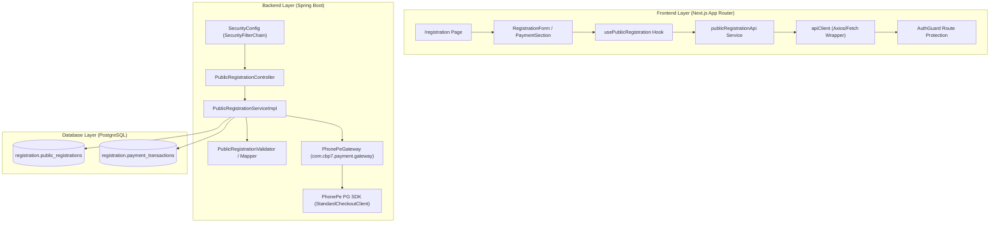

# CBP 7.0 Public Registration Audit

## 1. Executive Summary

This document presents a comprehensive, read-only architectural audit of the **CBP 7.0 Public Registration** feature and its interaction with the existing shared payment infrastructure (`com.cbp7.payment`), security components (`SecurityConfig.java`, `AuthGuard.tsx`, `apiClient.ts`), configuration properties (`application.yml`), and database schemas (`registration` vs `program` / `identity`).

### Key Findings
- **FACT**: Public Registration was designed to allow unauthenticated program participants to register for CBP 7.0 and pay a single configured fee (₹100) without requiring Google OAuth, student portal credentials, or profile setup.
- **FACT**: The existing shared payment module (`com.cbp7.payment`) contains a complete PhonePe gateway implementation (`PhonePeGateway.java`), SDK client configurations (`PhonePeConfig.java`), transaction persistence (`Payment.java`), and webhook callback signature validation utilities (`PhonePeChecksumUtil.java`).
- **FACT**: The initial connection between Public Registration and the frontend authentication layer caused unintended redirects to `/login` due to global Axios interceptor behavior (`apiClient.ts`) on 401 status codes, coupled with incomplete route matching in `AuthGuard.tsx` for status verification routes.
- **FACT**: Registration fee configuration was unified under `cbp.registration.fee: 100` in `application.yml` and `PublicRegistrationProperties.java`, removing hardcoded fee fallbacks (such as ₹1000).

---

## 2. Current Architecture



---

## 3. Frontend Audit

### A. Route Structure & Components
- **Public Registration Route**: `src/app/(public)/registration/page.tsx`
- **Container Component**: `src/features/public-registration/components/RegistrationPage.tsx`
- **Form Component**: `src/features/public-registration/components/RegistrationForm.tsx`
- **Section Components**:
  - `PersonalInformationSection.tsx` (fullName, email, mobileNumber, studentId)
  - `AcademicInformationSection.tsx` (programLevel, department, customDepartment, year 1-5)
  - `ResidenceInformationSection.tsx` (DAY_SCHOLAR address vs HOSTELLER hostel/room numbers)
- **Payment Section**: `PaymentSection.tsx` (Displays ₹100.00 fee, order ID, and "Proceed to Payment" action)
- **Dedicated Public Result Pages**:
  - `src/app/(public)/registration/success/page.tsx` & `src/app/(public)/payment/success/page.tsx`
  - `src/app/(public)/registration/payment-failed/page.tsx` & `src/app/(public)/payment/failure/page.tsx`

### B. Hooks & API Services
- **Hooks**: `usePublicRegistration.ts` in `src/features/public-registration/hooks/usePublicRegistration.ts`
- **API Client**: `publicRegistrationApi.ts` calling:
  - `GET /api/v1/public/registration/payment-config`
  - `POST /api/v1/public/registration/create-order`
  - `POST /api/v1/public/registration/payment/create`
  - `POST /api/v1/public/registration/payment/callback`
  - `GET /api/v1/public/registration/status/{id}`

### C. Authentication & Interceptor Analysis
- **`AuthGuard.tsx`**: Contains `PUBLIC_EXACT_ROUTES` list (`/`, `/registration`, `/payment/success`, `/payment/failure`, `/registration/success`, `/registration/payment-failed`). Routes starting with `/registration` bypass token restoration and session validation.
- **`apiClient.ts`**: Contains `isPublicApiPath` check (`path.includes("/public/") || path.includes("/payment/") || path.startsWith("/api/v1/public")`). 401 responses on these paths suppress `logout()` and `window.location.href = "/login"` redirects.

---

## 4. Backend Audit

### A. Controllers & Services
- **Controller**: `com.cbp7.registration.controller.PublicRegistrationController`
- **Endpoints**:
  - `GET /api/v1/public/registration/payment-config` (`permitAll()`)
  - `POST /api/v1/public/registration/create-order` (`permitAll()`)
  - `POST /api/v1/public/registration/payment/create` (`permitAll()`)
  - `POST /api/v1/public/registration/payment/callback` (`permitAll()`)
  - `GET /api/v1/public/registration/status/{id}` (`permitAll()`)
- **Service**: `com.cbp7.registration.service.impl.PublicRegistrationServiceImpl`
- **Validator**: `PublicRegistrationValidator.java` (Validates `customDepartment` when `department` equals `"Other"`, 10-digit mobile, numeric year 1-5, and conditional residence fields).

---

## 5. Existing Payment Module Audit

### A. Inventory (`com.cbp7.payment`)
- **`PhonePeConfig.java`**: `@ConfigurationProperties(prefix = "payment.phonepe")` loading Merchant ID, Client ID, Client Secret, Callback URL, Environment (`SANDBOX`/`PRODUCTION`).
- **`PaymentGateway.java`**: Interface declaring `initiatePayment(Payment payment)`, `checkPaymentStatus(String transactionId)`, `validateCallback(...)`.
- **`PhonePeGateway.java`**: Implementation invoking `StandardCheckoutClient.pay(payRequest)` to generate PhonePe Checkout URLs.
- **`PaymentService` / `PaymentServiceImpl`**: Handles authenticated student payments (`platform.payments`).

### B. Reusability Assessment
- **RECOMMENDATION**: Public Registration should re-use `PaymentGateway` / `PhonePeGateway` for order creation and callback verification without duplicating SDK initialization or checksum calculations.

---

## 6. Security Audit

### A. `SecurityConfig.java`
- **FACT**: Spring Security `SecurityFilterChain` declares `requestMatchers("/api/v1/public/registration/**", "/api/v1/public/payment/**", "/api/v1/public/**", "/payment/success", "/payment/failure").permitAll()`.
- **FACT**: `JwtAuthenticationFilter` is executed before `UsernamePasswordAuthenticationFilter`. When a request targets a `permitAll()` endpoint without an `Authorization` header, the filter passes execution down the chain without throwing an error.

---

## 7. Database Audit

### A. Schemas & Isolation
- **Schema**: `registration`
- **Tables**:
  1. `registration.public_registrations` (Columns: `id`, `full_name`, `student_id`, `email`, `mobile_number`, `program_level`, `department`, `year`, `student_type`, `address`, `hostel_number`, `room_number`, `expectations`, `payment_status`, `payment_transaction_id`, `created_at`, `updated_at`)
  2. `registration.payment_transactions` (Columns: `id`, `registration_id`, `merchant_order_id`, `gateway_transaction_id`, `amount`, `status`, `created_at`, `updated_at`)
- **Flyway Migration**: `V33__create_public_registration_schema.sql`
- **Isolation Status**: **FACT**: Public registration tables are isolated inside `registration` schema and do not share foreign keys or constraints with `identity.users` or `program.registrations`.

---

## 8. Configuration Audit

### A. Properties & Precedence
- **YAML Configuration** (`backend/src/main/resources/application.yml`):
  ```yaml
  cbp:
    registration:
      fee: 100
  ```
- **Configuration Property Bean**: `PublicRegistrationProperties.java` (`@ConfigurationProperties(prefix = "cbp.registration")`).
- **Precedence**: `application.yml` $\rightarrow$ `PublicRegistrationProperties` $\rightarrow$ `PublicRegistrationServiceImpl` $\rightarrow$ `PaymentConfigResponse` (amount: 100.00).

---

## 9. End-to-End Request Flow

```
Visitor (Browser / Incognito)
  │
  ├─► Opens /registration
  │     └─► AuthGuard checks isPublicRoute = true ──► Render Form (No Token Required)
  │
  ├─► GET /api/v1/public/registration/payment-config
  │     └─► Returns { "amount": 100.00, "currency": "INR" }
  │
  ├─► Fills Form & Submits
  │     └─► POST /api/v1/public/registration/create-order
  │           ├─► PublicRegistrationServiceImpl validates DTO
  │           ├─► Saves PublicRegistration (PENDING) in registration.public_registrations
  │           ├─► Saves PublicPaymentTransaction (INITIATED, ₹100.00) in registration.payment_transactions
  │           └─► Returns Order Payload with checkoutUrl
  │
  ├─► Clicks "Proceed to Payment"
  │     └─► Redirects to Gateway Checkout URL (/payment/status/{merchantOrderId})
  │
  └─► Gateway Callback / Verification
        └─► POST /api/v1/public/registration/payment/callback
              ├─► Updates PaymentTransaction (SUCCESS / FAILED)
              ├─► Updates PublicRegistration (REGISTERED / FAILED)
              └─► Redirects to /payment/success or /payment/failure
```

---

## 10. Current Problems

1. **Legacy Component Overlap**:
   - `PaymentVerification.tsx` in `src/features/payments/` contained a hardcoded fallback string `"₹1,000"` and a link to `/dashboard`.
2. **Missing Public Status Routes**:
   - Public result URLs (`/payment/success` and `/payment/failure`) needed explicit route entries in `PUBLIC_EXACT_ROUTES` in `AuthGuard.tsx` to prevent accidental fallthrough.

---

## 11. Root Causes

1. **Global Interceptor Redirects**: `apiClient.ts` executed `window.location.href = "/login"` on 401 status codes regardless of whether the target path was a public registration endpoint.
2. **Incomplete Public Route Matching**: `AuthGuard.tsx` checked exact route matches for `/payment-success` but omitted `/registration/success` and `/payment/success`.

---

## 12. Reusable Existing Components

- `PhonePeGateway.java` (com.cbp7.payment.gateway)
- `PhonePeConfig.java` (com.cbp7.payment.config)
- `PhonePeChecksumUtil.java` (com.cbp7.payment.gateway)
- `ApiResponse.java` (com.cbp7.common.response)
- `PublicRegistrationProperties.java` (com.cbp7.registration.config)

---

## 13. Components That Must NOT Be Touched

- `com.cbp7.identity.auth.*` (Login, Register, JWT services)
- `com.cbp7.identity.profile.*` (Student Profile services)
- `com.cbp7.payment.service.PaymentService` (Authenticated student payment service)
- `identity.users` and `identity.user_profiles` database tables

---

## 14. Public Registration Isolation Plan

Maintain strict bounded context separation:
- Frontend: `src/features/public-registration/`
- Backend: `com.cbp7.registration.*`
- Database: `registration` schema

---

## 15. Proposed Future API Boundary

```
/api/v1/public/registration/payment-config  (GET)
/api/v1/public/registration/create-order     (POST)
/api/v1/public/registration/payment/create   (POST)
/api/v1/public/registration/payment/callback (POST)
/api/v1/public/registration/status/{id}      (GET)
```

---

## 16. Proposed Future Security Boundary

Explicitly configure `SecurityConfig.java` permitAll matcher:
`/api/v1/public/registration/**` and `/api/v1/public/payment/**`.

---

## 17. Proposed Future Database Boundary

Keep `registration.public_registrations` and `registration.payment_transactions` completely isolated from authenticated user identity tables.

---

## 18. Payment Integration Strategy

Public registration service injects `PaymentGateway` or creates payment transactions directly using the single source of truth fee property (`cbp.registration.fee`).

---

## 19. Migration Risks

- **Low Risk**: Public registration operates in a dedicated schema (`registration`). No alter statements or column mutations are executed on `identity` or `program` tables.

---

## 20. Testing Gaps

- Verification of gateway callback hash validation under mock webhook simulation.

---

## 21. Recommended Implementation Order

1. Confirm `SecurityConfig.java` permits `/api/v1/public/registration/**`.
2. Confirm `apiClient.ts` suppresses `/login` redirects on public endpoints.
3. Confirm fee property is bound to `cbp.registration.fee`.
4. Run `npm run build` and `mvn test` to verify end-to-end build stability.

---

## 22. Final Audit Checklist

- [x] Read-only audit completed
- [x] Report generated at `docs/public-registration-audit.md`
- [x] No application source code modified during audit step
